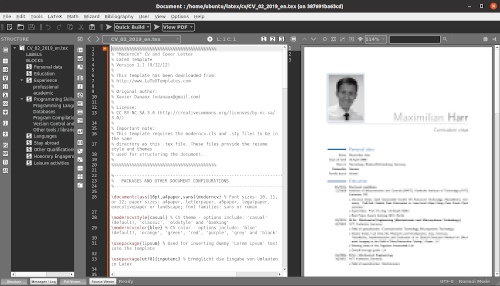

# Docker Collection

This is a collection of docker containers that we found useful. 

## Getting Started
All you need to have is docker and docker-compose. 
You can find a installation script for Ubuntu [here](https://github.com/maximilianharr/code_snippets/blob/master/sh/install_docker.sh)

Go to a docker folder and run
```bash
docker-compose build
docker-compuse up
```

That's it :)

If you need to open a shell within the docker
```bash
docker exec -it ${FOLDER}_${FOLDER}_1 bash
```

## Docker Images

### Latex
Runs texmaker GUI on host with full latex distribution.  
By default ~/workspace/latex is mounted to the home folder of the container (see docker-compose.yml).  
  

## License

[Apache License 2.0](LICENSE)